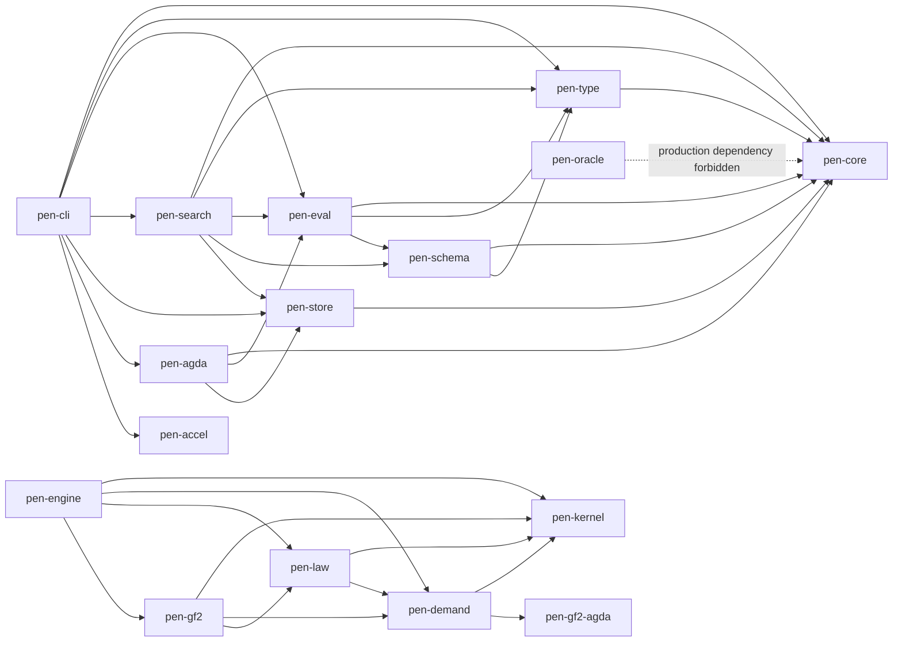
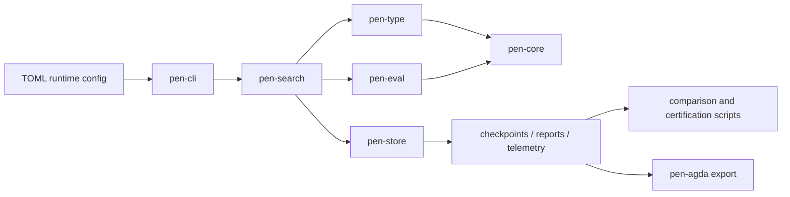
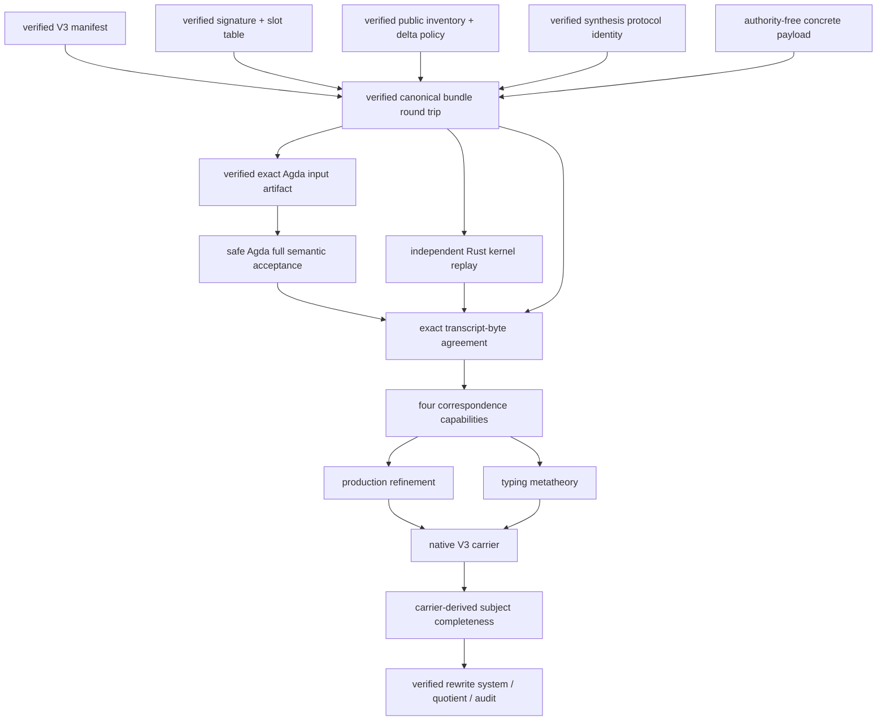

# `pen-atomic` Architecture

Date: 2026-07-30
Scope: the complete repository, with emphasis on the current Law V2
production-refinement plan

## 1. Architectural overview

`pen-atomic` contains two distinct computational stories:

1. a mature legacy search/replay system that discovers and persists the
   repository’s known fifteen-step corpus under bounded, target-informed
   profiles; and
2. a newer Law V2 system that is oracle-free, proof-carrying, profile-relative,
   and deliberately fail-closed.

They share a repository and some low-level research context, but they do not
make the same claim.

```text
legacy lane
anonymous MBTT search -> structural scoring/bar -> selected step
    -> stored artifacts -> comparison/export

Law V2 lane
registered bootstrap -> typed demand census -> complete discharger quotient
    -> free sealing -> branch cone -> certified empty-debt halt
```

The legacy lane is a useful chassis, oracle, regression suite, and performance
laboratory. The Law V2 lane is the candidate implementation of the repaired
two-law theorem. Until every proof layer exists, the lawful executable returns
`Unknown`.

The current critical path is a bridge inside the Law V2 research layer:

```text
verified Rust objects
        │
        ▼
one canonical production bundle
        │
        ├───────────────┐
        ▼               ▼
independent Rust     safe Agda
kernel replay        decode/check
        │               │
        └───────┬───────┘
                ▼
      exact transcript bytes
                │
                ▼
  opaque correspondence capabilities
                │
                ▼
 production refinement / typing metatheory
```

No digest-only, Boolean-only, generated-answer, or caller-asserted path may
cross this boundary.

## 2. Repository topology

### 2.1 Root workspace

The root `Cargo.toml` contains the stable executable and Law V2 production
crates:

```text
pen-core                  legacy structural core
pen-type                  legacy structural typing/admissibility
pen-schema                legacy schema/grammar experiments
pen-eval                  legacy evaluation and diagnostics
pen-search                legacy live search
pen-store                 legacy artifact persistence
pen-agda                  downstream legacy Agda export
pen-accel                 optional acceleration
pen-cli                   legacy user-facing CLI

pen-kernel                independent Law V2 dependent core
pen-gf2-agda              pinned checker-readiness/reference support
pen-demand                finite demand and GSC vertical slice
pen-law                   Law V2 contracts, bootstrap, profiles
pen-gf2                   finite-fragment contracts/adapters
pen-engine                fail-closed Law V2 orchestration
pen-oracle                non-production reference/oracle boundary

xtask                     repository maintenance/export tasks
```

The root dependency graph, omitting third-party libraries, is approximately:



`pen-oracle` has a normal dependency on `pen-core` for historical fixtures.
Its Law V2-facing dependencies are test-only. Production Law V2 crates carry
metadata declaring `oracle_access = false`.

### 2.2 Nested isolated workspaces

Several theorem experiments are deliberately not root workspace members:

| Workspace | Role | Direct local dependencies |
| --- | --- | --- |
| `pen-contextual-completion` | bounded generic prototype for a proposed contextual-completion principle | `pen-kernel` |
| `pen-kernel-synthesis` | proof-carrying lambda/unit synthesis successor | `pen-kernel` |
| `pen-production-wire` | dependency-free canonical cross-language byte grammar | none |
| `pen-semantic-audit` | generic semantic, cost, rewrite, production-refinement, and correspondence prototype | `pen-kernel`, `pen-kernel-synthesis`, `pen-production-wire` |

This isolation is intentional. The root manifest and lockfile are bound into
issued H3/H4 evidence. Adding experimental dependencies to the root workspace
would change those evidence inputs.

Nested crates are built by manifest path, for example:

```powershell
cargo test --manifest-path crates/pen-production-wire/Cargo.toml
cargo test --manifest-path crates/pen-kernel-synthesis/Cargo.toml --locked
cargo test --manifest-path crates/pen-semantic-audit/Cargo.toml --locked
```

## 3. Legacy lane

### 3.1 Responsibilities

The legacy lane implements deterministic, bounded discovery for the known
corpus:



The important profile split is:

- `strict_canon_guarded`: authoritative only within the legacy corpus
  contract; and
- `realistic_frontier_shadow`: a broader comparison-backed lane with live
  late-stage competition and frontier retention.

### 3.2 Core crates

#### `pen-core`

Defines the anonymous structural data model:

- expressions, clauses, declarations, and telescopes;
- canonical encodings and stable structural keys;
- exact rationals and hashes;
- library snapshots and interners; and
- historical reference telescopes still used as oracle fixtures.

The presence of reference telescopes is one reason this layer cannot be
treated wholesale as the Law V2 theorem kernel.

#### `pen-type`

Provides structural legality:

- scope and telescope checking;
- admissibility;
- connectivity;
- obligations and structural debt;
- elaboration and normalization helpers; and
- specialized cubical/internality research modules.

Some late-stage admissibility and obligation logic is target-shaped. It
belongs to the legacy contract unless independently replaced by typed generic
demand extraction.

#### `pen-eval`

Owns legacy evaluation and diagnostics:

- structural `nu`;
- exact bar and `rho`;
- semantic-minimality/SCC checks;
- typed-family and internality experiments; and
- numerous historical proof probes.

The Law V2 contract treats legacy bar values as diagnostics only. Bar clearance
must not decide constitutive acceptance.

#### `pen-search`

Is the legacy orchestration and search engine:

- enumeration;
- prefix memoization and exact screening;
- canonical deduplication;
- deterministic acceptance;
- frontier retention;
- resume compatibility; and
- many historical execution programs.

The legacy acceptance rule selects a winner, normally by minimal positive
overshoot plus deterministic tie-breakers. The Law V2 target instead retains
the complete quotient cone of total dischargers.

#### `pen-store`

Owns persistent artifacts:

- run and step manifests;
- step checkpoints;
- bounded frontier generations;
- hot/cold shards and dedupe segments;
- checksums;
- SQLite metadata;
- telemetry; and
- compatibility-gated resume.

Step checkpoints are stable truth artifacts. Frontier checkpoints are
disposable accelerators whose reuse is conditional on exact compatibility.

#### `pen-cli`, `pen-agda`, and `pen-accel`

`pen-cli` exposes `run`, `resume`, `inspect`, and `export-agda`.

`pen-agda` is downstream of accepted legacy artifacts. It renders and can
invoke verification, but it cannot affect candidate acceptance.

`pen-accel` is optional. CPU behavior remains the reference; acceleration is
outside the authoritative acceptance contract.

### 3.3 Legacy artifact surface

A run may contain:

```text
run.json
config.toml
meta.sqlite3
telemetry.ndjson
reports/latest.txt
reports/latest.debug.txt
reports/steps/step-XX-summary.json
checkpoints/steps/step-XX.json
checkpoints/frontier/step-XX/band-YY/frontier.manifest.json
checkpoints/frontier/step-XX/band-YY/hot-*.bin
checkpoints/frontier/step-XX/band-YY/cold-*.bin
checkpoints/frontier/step-XX/band-YY/dedupe-*.txt
checkpoints/frontier/step-XX/band-YY/frontier-runtime.json
```

These artifacts support reproducibility and comparison. They do not establish
that the repaired two laws derived the stored sequence.

## 4. Law V2 root architecture

### 4.1 `pen-kernel`: the trusted bounded dependent core

`pen-kernel` is independent of the legacy structural core. It defines:

- `Term`: sort, unit type, unit, variables, globals, `Pi`, lambda, and apply;
- dependent contexts and signatures;
- stable 32-byte `GlobalId` values;
- open judgments;
- bounded checking, normalization, equality, and dependency analysis;
- exact signature extension; and
- opaque verified signatures, contexts, derivations, equivalences, and
  specializations.

The kernel is intentionally not a complete cubical type theory. Unsupported
features fail closed.

The trust pattern is:

```text
unchecked serializable input
        │
        ▼
deterministic bounded replay
        │
        ▼
opaque capability with private fields
```

Verified capability types are not deserializable.

### 4.2 `pen-demand`: finite relative census and GSC slice

The base module computes a deterministic census relative to explicitly
supplied:

- verified signature;
- finite demand domain;
- opaque width-two window;
- finite rules;
- library seeds; and
- resource limits.

This proves completeness only relative to that registry.

The `gsc` subtree implements the frozen narrow inductive-completion vertical
slice used for H3:

- exact semantic manifest;
- event/history and anchor representation;
- open use/computation families;
- syntax-directed compilation;
- typed operational derivability;
- response carrier;
- quotient/disposition; and
- pinned safe-Agda reference agreement.

### 4.3 `pen-law`: contracts, history, and profile registry

`pen-law` contains:

- the distinction between semantic-family and legacy structural registers;
- the fixed width-two demand window;
- the exact registered Law V2A bootstrap and export;
- history/profile types;
- H3/H4 profile/result registry entries; and
- fail-closed certificate contracts.

It must not depend on the legacy evaluator, search engine, or oracle.

### 4.4 `pen-gf2`: finite-fragment boundary

`pen-gf2` combines the kernel, demand, and law contracts into a versioned
finite-fragment decision boundary. Its four-way outcomes distinguish:

- proven;
- refuted;
- outside fragment; and
- resource exhausted/unknown.

This prevents bounded failure from becoming a false theorem or false halt.

### 4.5 `pen-engine`: lawful orchestration

The Law V2 binary is `pen-law-v2`.

At the generic startup boundary, its outcome type intentionally contains only
`Unknown` while the full proof stack is incomplete. It also contains the
specialized, frozen H3/H4 execution:

- H3 exhausts the narrow response carrier and yields the unique direct
  eliminator class;
- H4 seals it, recomputes the width-two inventory, and proves debt-free halt.

This specialized result does not grant the generic engine an `Advance` or
`Halt` constructor for arbitrary profiles.

### 4.6 `pen-oracle`

`pen-oracle` contains historical targets, labels, and compatibility probes.
It is permitted in tests and post-run interpretation. It is forbidden as a
production dependency of the Law V2 theorem lane.

## 5. Generic theorem workspaces

### 5.1 `pen-kernel-synthesis`

This isolated crate builds syntax-directed synthesis derivations for the exact
lambda/unit fragment and replays them through `pen-kernel`.

Protocol V2 is the concrete certificate system used by the current production
bridge. It defines:

- eight synthesis rules;
- typed conversion endpoints;
- explicit beta, transparent-delta, and congruence traces;
- common normal forms;
- complete no-redex censuses;
- public/checker universe restrictions;
- variable/global lookup metadata;
- dependent application result substitution; and
- opaque verified synthesis codes after replay.

The synthesis mirror is not trusted. The unchanged kernel replay is the local
authority. Historical predecessor-public status is not inferred here; it is
bound later in `pen-semantic-audit`.

### 5.2 `pen-semantic-audit`

This workspace is the main generic theorem laboratory. Its modules form
several layers.

#### Manifest and inventory

- `manifest.rs`: V1/V2/V3 semantic manifests and cost manifests;
- `inventory.rs`: exact public event/group/declaration/equation/demand/Q3
  replay and coverage;
- `inventory_compatibility.rs`: preserved V1→V2 inventory invariants; and
- `production_inventory_bridge.rs`: binds production use to verified
  inventory authority.

#### Semantic construction

- `carrier.rs`: finite carrier prototypes;
- `construction_substitution.rs` and `substitution_metatheory.rs`:
  derivation-local substitution witnesses and theorem packages;
- `ordinary_beta.rs`: verifier-minted ordinary beta;
- `historical_rewrite.rs`: predecessor rewrite authority;
- `finite_rewrite.rs` and `rewrite_inventory.rs`: typed finite rewrite
  assembly;
- `quotient.rs`: Q2/family quotienting;
- `weakening.rs`: family weakening/restriction and marginal support;
- `provenance.rs`: dependency support and SR2; and
- `cost.rs`: kernel-cost decisions.

#### V2/V3 authority ordering

- `semantic_authority.rs`: V2 authority composition;
- `semantic_authority_v3.rs`: demand-neutral seed/family identity and deferred
  nonempty demand provenance;
- `typed_occurrence.rs` and `typed_occurrence_v3.rs`: typed subterm
  occurrences, with the V3 path retaining synthesis capabilities; and
- `typing_metatheory.rs`: foundation versus stronger production metatheory.

#### Production refinement

- `production_refinement.rs`: verified global-slot table and universe
  boundary;
- `production_refinement_theorem.rs`: Agda foundation, synthesis identity,
  predecessor-public delta binding, opaque correspondence types, and the
  aggregate fail-closed diagnostic;
- `production_refinement_wire_authority.rs`: exact-byte capability frontier;
- `production_wire_slots.rs`: verified signature/slot derivation;
- `production_wire_builder.rs`: canonical bundle assembly; and
- `production_wire_input.rs`: fixed Agda input rendering/extraction.

The crate has no live Profile A adapter. Its manifests remain unfrozen and
`proposed_not_adopted`.

### 5.3 `pen-contextual-completion`

This is a parallel, bounded generic falsification prototype for a possible
two-sided contextual-completion principle. It has no registered-prefix access,
candidate-generation authority, or production-payment authority. It is not on
the current production-refinement critical path.

## 6. Canonical production-wire architecture

### 6.1 Design constraints

`pen-production-wire` is a nested, dependency-free workspace. It deliberately
does not depend on:

- `pen-kernel`;
- `pen-kernel-synthesis`;
- `pen-semantic-audit`;
- `pen-oracle`;
- Serde/JSON; or
- live runtime/profile code.

This prevents semantic authority from leaking into the byte grammar.

### 6.2 Envelope

The V1 envelope is:

```text
16 bytes  magic: PEN-PROD-WIRE-V1
u16 LE    schema version: 1
u16 LE    section count: 11

repeat exactly 11 times:
  u8      section tag
  u64 LE  payload byte length
  bytes   payload
```

Sections must appear exactly once and in the following order:

| Tag | Payload |
| ---: | --- |
| 1 | V3 correspondence-manifest surface |
| 2 | production signature binding |
| 3 | global-slot table |
| 4 | production contexts |
| 5 | conversion certificates |
| 6 | nested conversion-typing supplements |
| 7 | synthesis certificates |
| 8 | exact V3 Q0 inventory |
| 9 | fresh-rule schemas |
| 10 | exact family inventory |
| 11 | family payloads |

All enum tags are one byte. Integers are little-endian. Byte strings and
sequences use `u64` lengths. Options use only `0` and `1`. Decoding requires
full consumption and canonical re-encoding.

### 6.3 Model

`model.rs` defines authority-free data only:

- fixed-size `WireIdV1`;
- V3 manifest and signature surfaces;
- wire terms using finite global slots;
- chronological global-slot entries;
- oldest-first contexts;
- reduction paths, steps, traces, endpoints, and no-redex census;
- eight synthesis-code shapes;
- conversion-typing supplements;
- seven Q0 rules;
- fresh-rule schemas;
- three family codes and concrete payloads; and
- the eleven-section aggregate bundle.

No model type is a theorem capability.

### 6.4 Codec and validator

`codec.rs` owns byte encoding/decoding and resource limits.

`validate.rs` owns structural invariants:

- exact V3 identity and unfrozen/non-live authority flags;
- exact universe and inventory lists;
- global-slot chronology, identity uniqueness, and strict-prior references;
- term/context scope;
- delta-policy mapping and ordering;
- trace connectivity, endpoints, normal forms, and recomputed no-redex census;
- synthesis rule/subject shape and dependent application result;
- Q0 and family inventory exactness;
- fresh-rule non-recursive pattern shape; and
- family reference validity.

Successful validation means only “member of the canonical structural
grammar.” It does not mean “well typed in the kernel” or “accepted by Agda.”

## 7. Safe Agda architecture

### 7.1 Existing lambda/unit theorem layer

`crates/pen-semantic-audit/agda/LawV2/LambdaUnit` contains:

- abstract typing syntax and judgments;
- substitution, weakening, and reduction metatheory;
- synthesis;
- conversion typing;
- finite production syntax and decoding;
- production synthesis-code V2;
- production inventory bridge; and
- family naturality.

These modules prove substantial internal Agda facts. Before the current wire,
they did not prove that concrete Rust bytes decoded to those exact objects.

### 7.2 New wire modules

The new `LawV2/Wire` layer is:

```text
Bytes.agda
   ↓
Decoder.agda
   ↓
Envelope.agda
   ↓
ProductionBundleV1.agda
   ↓
ContextChecker.agda
```

#### `Bytes.agda`

Defines intrinsic bytes, bounded byte construction, equality, endian
conversion, and byte-list helpers.

#### `Decoder.agda`

Defines a total state-style decoder over byte lists:

- byte;
- `u16`, `u32`, `u64`;
- fixed bytes and length-delimited byte strings;
- lists;
- options;
- Booleans; and
- full-consumption execution.

It also proves round trips for the fixed-width primitives and canonical sized
bytes.

#### `Envelope.agda`

Defines the exact magic, version, eleven ordered section tags, canonical
encoding, raw parsing, full-consumption decoding, per-section round trips, and
the whole-envelope round trip.

#### `ProductionBundleV1.agda`

Defines the wire-term mirror and currently parses the first four semantic
sections:

- manifest;
- signature;
- global-slot table; and
- contexts.

The remaining seven section payloads are retained as exact raw envelope
bytes, not discarded.

#### `ContextChecker.agda`

Checks:

- exact semantic/synthesis schema identity;
- profile and protocol identifiers;
- 32-byte identities;
- unfrozen/non-live authority state;
- public/checker/formation universe sets;
- synthesis rule inventory;
- chronological, unique global slots;
- prior-only global references;
- oldest-first context scoping; and
- exact delta mapping to bodyful declarations.

It returns dependent evidence that the computed structural check equals
`true`. It does not yet mint production acceptance.

### 7.3 Generated input boundary

Rust generates one fixed safe Agda module whose only varying content is the
canonical byte list. `production_wire_input.rs`:

1. renders the module;
2. extracts the bytes;
3. requires exact equality with the original bytes;
4. rerenders; and
5. requires exact template equality.

No expected theorem result or transcript is embedded beside the bytes.

## 8. Production authority model

### 8.1 Opaque capabilities

The current bridge reserves four non-deserializable capability types:

- `VerifiedCanonicalProductionBundleV1`;
- `VerifiedAgdaProductionAcceptanceV1`;
- `VerifiedRustProductionReplayV1`; and
- `VerifiedProductionTranscriptAgreementV1`.

The final private factory will consume all four and be the only constructor
for:

- `VerifiedFiniteContextCorrespondenceV1`;
- `VerifiedKernelBaseConversionCorrespondenceV1`;
- `VerifiedSynthesisCodeCorrespondenceV1`;
- `VerifiedV3InventoryCorrespondenceV1`;
- `VerifiedLambdaUnitProductionRefinementV1`; and
- `VerifiedLambdaUnitTypingMetatheoryV1`.

### 8.2 Authority ordering



The arrows are authority dependencies, not just data flow. Downstream objects
must not be used to manufacture an upstream proof.

### 8.3 Generic soundness versus carrier completeness

The architecture keeps two claims separate:

```text
generic soundness:
  every certificate accepted by the checker has the stated meaning

carrier completeness:
  the canonical bundle contains every root required by the native V3 carrier
```

Production refinement supplies the first. A later native-carrier theorem must
supply the second by exact set equality.

## 9. Trust and honesty boundaries

### 9.1 Trusted or intended-to-be-trusted components

The final claim is intended to rely on:

- the reviewed `pen-kernel` implementation and its bounded protocol identity;
- safe Agda and its pinned source/runtime boundary;
- the fixed production-wire specification;
- exact byte comparisons;
- independently replayed certificate algorithms; and
- reviewed, frozen semantic/profile manifests.

The current prototype has not yet completed all of these gates.

### 9.2 Untrusted inputs

The following are data to be checked:

- serialized manifests;
- signature claims;
- contexts and terms;
- conversion and synthesis certificates;
- inventories;
- fresh-rule and family payloads;
- generated Agda input source;
- transcripts;
- digests supplied by callers; and
- legacy/oracle artifacts.

### 9.3 Forbidden authority shortcuts

No verified object may be created from:

- a success Boolean;
- a matching tag or rule count;
- a theorem/source digest alone;
- a caller-provided accepted-section mask;
- a caller-selected root list;
- a generated expected transcript;
- matching Rust/Agda type names; or
- a legacy result that happens to have the desired shape.

## 10. Runtime and artifact architecture for the current plan

The production-refinement work does not yet expose a live CLI pipeline. Its
current artifacts are source-level protocols and test fixtures:

```text
verified Rust fixtures/capabilities
  -> ProductionRefinementBundleV1
  -> canonical byte vector
  -> generated Agda byte-list module
  -> Rust and Agda test/check transcripts
```

The future stored production artifact should retain:

- canonical bundle bytes;
- exact generated Agda input source or its recoverable canonical form;
- Agda source-tree/runtime identity;
- Rust kernel and synthesis protocol identities;
- accepted section mask;
- Rust transcript bytes;
- Agda transcript bytes;
- exact-comparison results;
- bundle and transcript digests computed after comparison; and
- the final capability/factory result.

Diagnostic stdout must not be the canonical transcript.

## 11. Testing architecture

### 11.1 Canonical wire

The wire tests cover:

- exact round trip;
- every truncation point;
- trailing bytes;
- wrong magic/version/count;
- missing, duplicate, reordered, or unknown sections;
- unknown term/authority tags;
- invalid Boolean and option tags;
- oversized sequences;
- slot, identity, prior-reference, context, universe, and delta mutations;
- conversion, no-redex, synthesis, and formation mutations; and
- Q0, family, and fresh-rule mutations.

### 11.2 Semantic audit

The isolated library suite exercises the existing V1/V2/V3 manifest,
inventory, cost, substitution, rewrite, occurrence, production-refinement,
slot, input, builder, and authority-frontier surfaces.

### 11.3 Safe Agda

All new wire modules are checked with:

```powershell
agda --safe --without-K --ignore-interfaces `
  -i crates/pen-semantic-audit/agda `
  crates/pen-semantic-audit/agda/LawV2/Wire/ContextChecker.agda
```

`ContextChecker` transitively checks the new byte, decoder, envelope, and
bundle modules.

Generated `.agdai`, `.orig`, and `.rej` files are build/edit artifacts and
must not enter the source protocol or commits.

### 11.4 Current snapshot

As of this document:

- production wire: 7 passed;
- semantic-audit library: 166 passed, 6 ignored;
- safe Agda wire/context checker: passed; and
- forbidden-marker scan over new wire/bridge code: clean.

This is development evidence, not adoption or live-profile authority.

## 12. Change rules for future contributors

### 12.1 Adding wire data

Any wire change must:

1. use a new version or an explicitly compatible extension rule;
2. update Rust model, codec, validator, and mutation tests;
3. update safe Agda decoding and round-trip proofs;
4. update both transcript implementations;
5. update the adjudication before observing a new production result; and
6. preserve full-consumption and exact canonical re-encoding.

### 12.2 Adding semantic authority

New authority must:

- be represented by an opaque, non-deserializable capability;
- have one deterministic replay/check constructor;
- bind all relevant protocol and input identities;
- fail closed on missing evidence or resource exhaustion;
- be composed only after its dependencies; and
- have adversarial tests showing that caller claims cannot mint it.

### 12.3 Adding a productive profile

A new constitutive profile must be:

- mathematically motivated without reference to the desired next structure;
- versioned;
- independently reviewed;
- frozen before the registered prefix is exposed to it;
- tested on non-Genesis generic examples and falsifiers; and
- unable to access oracle labels or expected traces.

### 12.4 Modifying protected evidence inputs

Do not casually:

- add nested theorem crates to the root workspace;
- change the root lockfile;
- alter the issued H3/H4 manifest inputs;
- rewrite historical result documents; or
- make a production crate depend on `pen-oracle`.

If such a change becomes necessary, it requires an explicit new evidence
version rather than silently retaining the old identity.

## 13. Current architectural frontier

Implemented:

- dependency-free canonical Rust byte grammar;
- strict structural validator and adversarial codec tests;
- verified signature-to-slot derivation;
- canonical bundle builder;
- exact fixed Agda input transport;
- opaque authority frontier;
- safe Agda bytes, primitive decoder, envelope, and round trips;
- safe Agda semantic parsing/checking of manifest, signature, slots, and
  contexts.

Not yet implemented:

- semantic Agda decoding of sections 5–11;
- full finite context/global correspondence to `PTm`/`PCtx`;
- binder-local conversion checking;
- complete synthesis soundness for decoded payloads;
- Q0/fresh/family payload correspondence;
- independent Rust replay of a complete canonical bundle;
- the versioned common normalized transcript;
- exact transcript-byte agreement;
- the single successful correspondence factory;
- production refinement and stronger typing metatheory;
- native V3 carrier and carrier-derived subject completeness;
- verified rewrite system, quotient, weakening/marginals, provenance, SR2,
  adoption, freeze, and live Profile A adapter.

The architecture is therefore in a healthy fail-closed state: the lower-level
wire and structural boundaries can be developed and tested, while all
semantic and live-run authority remains unavailable until the ordered theorem
gates are complete.
