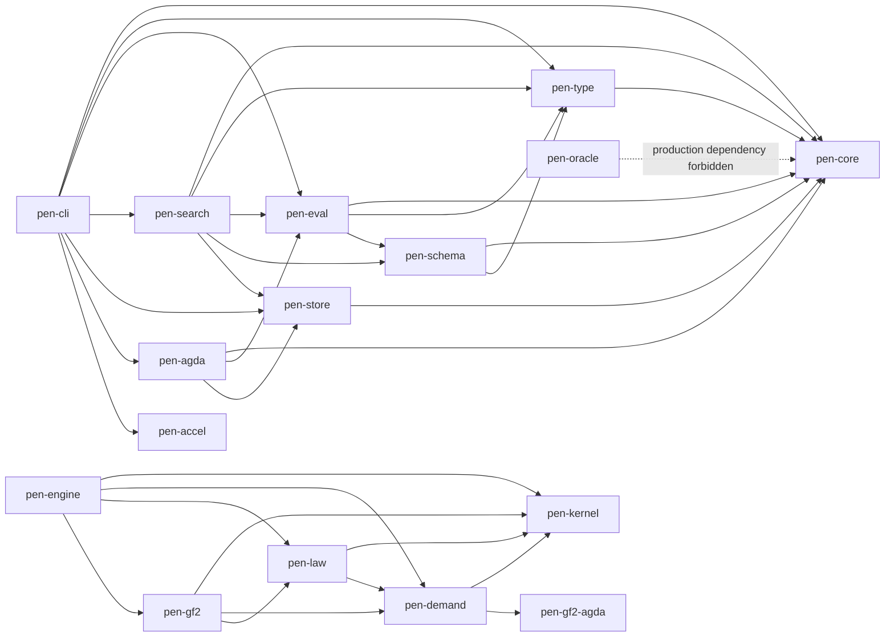
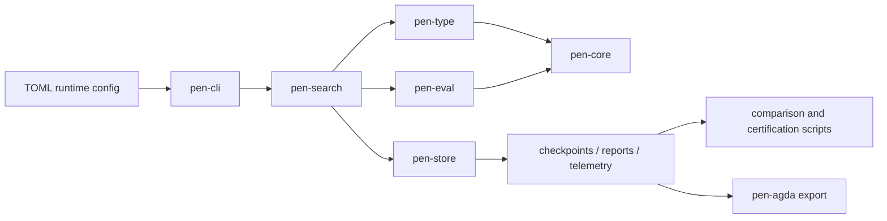
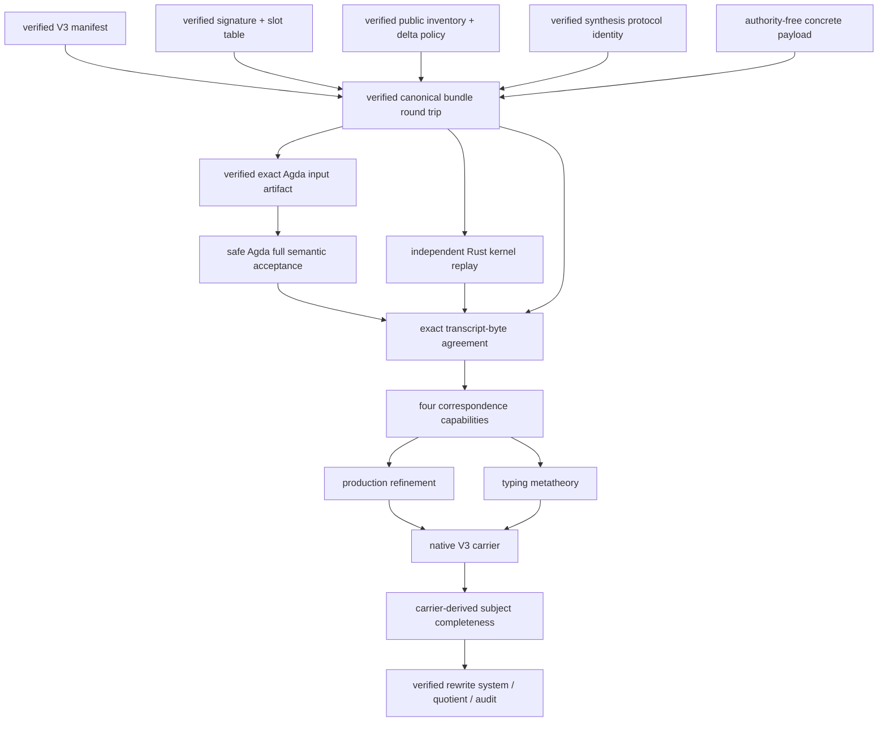

# `pen-atomic` Architecture

Date: 2026-07-30
Scope: the complete repository, with emphasis on the current Law V2
production-refinement plan

## 1. Architectural overview

`pen-atomic` contains two distinct computational stories:

1. a mature legacy search/replay system that discovers and persists the
   repository’s known fifteen-step corpus under bounded, target-informed
   profiles; and
2. a newer Law V2 system that is oracle-free, proof-carrying, profile-relative,
   and deliberately fail-closed.

They share a repository and some low-level research context, but they do not
make the same claim.

```text
legacy lane
anonymous MBTT search -> structural scoring/bar -> selected step
    -> stored artifacts -> comparison/export

Law V2 lane
registered bootstrap -> typed demand census -> complete discharger quotient
    -> free sealing -> branch cone -> certified empty-debt halt
```

The legacy lane is a useful chassis, oracle, regression suite, and performance
laboratory. The Law V2 lane is the candidate implementation of the repaired
two-law theorem. Until every proof layer exists, the lawful executable returns
`Unknown`.

The current critical path is a bridge inside the Law V2 research layer:

```text
verified Rust objects
        │
        ▼
one canonical production bundle
        │
        ├───────────────┐
        ▼               ▼
independent Rust     safe Agda
kernel replay        decode/check
        │               │
        └───────┬───────┘
                ▼
      exact transcript bytes
                │
                ▼
  opaque correspondence capabilities
                │
                ▼
 production refinement / typing metatheory
```

No digest-only, Boolean-only, generated-answer, or caller-asserted path may
cross this boundary.

## 2. Repository topology

### 2.1 Root workspace

The root `Cargo.toml` contains the stable executable and Law V2 production
crates:

```text
pen-core                  legacy structural core
pen-type                  legacy structural typing/admissibility
pen-schema                legacy schema/grammar experiments
pen-eval                  legacy evaluation and diagnostics
pen-search                legacy live search
pen-store                 legacy artifact persistence
pen-agda                  downstream legacy Agda export
pen-accel                 optional acceleration
pen-cli                   legacy user-facing CLI

pen-kernel                independent Law V2 dependent core
pen-gf2-agda              pinned checker-readiness/reference support
pen-demand                finite demand and GSC vertical slice
pen-law                   Law V2 contracts, bootstrap, profiles
pen-gf2                   finite-fragment contracts/adapters
pen-engine                fail-closed Law V2 orchestration
pen-oracle                non-production reference/oracle boundary

xtask                     repository maintenance/export tasks
```

The root dependency graph, omitting third-party libraries, is approximately:



`pen-oracle` has a normal dependency on `pen-core` for historical fixtures.
Its Law V2-facing dependencies are test-only. Production Law V2 crates carry
metadata declaring `oracle_access = false`.

### 2.2 Nested isolated workspaces

Several theorem experiments are deliberately not root workspace members:

| Workspace | Role | Direct local dependencies |
| --- | --- | --- |
| `pen-contextual-completion` | bounded generic prototype for a proposed contextual-completion principle | `pen-kernel` |
| `pen-kernel-synthesis` | proof-carrying lambda/unit synthesis successor | `pen-kernel` |
| `pen-production-wire` | dependency-free canonical cross-language byte grammar | none |
| `pen-semantic-audit` | generic semantic, cost, rewrite, production-refinement, and correspondence prototype | `pen-kernel`, `pen-kernel-synthesis`, `pen-production-wire` |

This isolation is intentional. The root manifest and lockfile are bound into
issued H3/H4 evidence. Adding experimental dependencies to the root workspace
would change those evidence inputs.

Nested crates are built by manifest path, for example:

```powershell
cargo test --manifest-path crates/pen-production-wire/Cargo.toml
cargo test --manifest-path crates/pen-kernel-synthesis/Cargo.toml --locked
cargo test --manifest-path crates/pen-semantic-audit/Cargo.toml --locked
```

## 3. Legacy lane

### 3.1 Responsibilities

The legacy lane implements deterministic, bounded discovery for the known
corpus:



The important profile split is:

- `strict_canon_guarded`: authoritative only within the legacy corpus
  contract; and
- `realistic_frontier_shadow`: a broader comparison-backed lane with live
  late-stage competition and frontier retention.

### 3.2 Core crates

#### `pen-core`

Defines the anonymous structural data model:

- expressions, clauses, declarations, and telescopes;
- canonical encodings and stable structural keys;
- exact rationals and hashes;
- library snapshots and interners; and
- historical reference telescopes still used as oracle fixtures.

The presence of reference telescopes is one reason this layer cannot be
treated wholesale as the Law V2 theorem kernel.

#### `pen-type`

Provides structural legality:

- scope and telescope checking;
- admissibility;
- connectivity;
- obligations and structural debt;
- elaboration and normalization helpers; and
- specialized cubical/internality research modules.

Some late-stage admissibility and obligation logic is target-shaped. It
belongs to the legacy contract unless independently replaced by typed generic
demand extraction.

#### `pen-eval`

Owns legacy evaluation and diagnostics:

- structural `nu`;
- exact bar and `rho`;
- semantic-minimality/SCC checks;
- typed-family and internality experiments; and
- numerous historical proof probes.

The Law V2 contract treats legacy bar values as diagnostics only. Bar clearance
must not decide constitutive acceptance.

#### `pen-search`

Is the legacy orchestration and search engine:

- enumeration;
- prefix memoization and exact screening;
- canonical deduplication;
- deterministic acceptance;
- frontier retention;
- resume compatibility; and
- many historical execution programs.

The legacy acceptance rule selects a winner, normally by minimal positive
overshoot plus deterministic tie-breakers. The Law V2 target instead retains
the complete quotient cone of total dischargers.

#### `pen-store`

Owns persistent artifacts:

- run and step manifests;
- step checkpoints;
- bounded frontier generations;
- hot/cold shards and dedupe segments;
- checksums;
- SQLite metadata;
- telemetry; and
- compatibility-gated resume.

Step checkpoints are stable truth artifacts. Frontier checkpoints are
disposable accelerators whose reuse is conditional on exact compatibility.

#### `pen-cli`, `pen-agda`, and `pen-accel`

`pen-cli` exposes `run`, `resume`, `inspect`, and `export-agda`.

`pen-agda` is downstream of accepted legacy artifacts. It renders and can
invoke verification, but it cannot affect candidate acceptance.

`pen-accel` is optional. CPU behavior remains the reference; acceleration is
outside the authoritative acceptance contract.

### 3.3 Legacy artifact surface

A run may contain:

```text
run.json
config.toml
meta.sqlite3
telemetry.ndjson
reports/latest.txt
reports/latest.debug.txt
reports/steps/step-XX-summary.json
checkpoints/steps/step-XX.json
checkpoints/frontier/step-XX/band-YY/frontier.manifest.json
checkpoints/frontier/step-XX/band-YY/hot-*.bin
checkpoints/frontier/step-XX/band-YY/cold-*.bin
checkpoints/frontier/step-XX/band-YY/dedupe-*.txt
checkpoints/frontier/step-XX/band-YY/frontier-runtime.json
```

These artifacts support reproducibility and comparison. They do not establish
that the repaired two laws derived the stored sequence.

## 4. Law V2 root architecture

### 4.1 `pen-kernel`: the trusted bounded dependent core

`pen-kernel` is independent of the legacy structural core. It defines:

- `Term`: sort, unit type, unit, variables, globals, `Pi`, lambda, and apply;
- dependent contexts and signatures;
- stable 32-byte `GlobalId` values;
- open judgments;
- bounded checking, normalization, equality, and dependency analysis;
- exact signature extension; and
- opaque verified signatures, contexts, derivations, equivalences, and
  specializations.

The kernel is intentionally not a complete cubical type theory. Unsupported
features fail closed.

The trust pattern is:

```text
unchecked serializable input
        │
        ▼
deterministic bounded replay
        │
        ▼
opaque capability with private fields
```

Verified capability types are not deserializable.

### 4.2 `pen-demand`: finite relative census and GSC slice

The base module computes a deterministic census relative to explicitly
supplied:

- verified signature;
- finite demand domain;
- opaque width-two window;
- finite rules;
- library seeds; and
- resource limits.

This proves completeness only relative to that registry.

The `gsc` subtree implements the frozen narrow inductive-completion vertical
slice used for H3:

- exact semantic manifest;
- event/history and anchor representation;
- open use/computation families;
- syntax-directed compilation;
- typed operational derivability;
- response carrier;
- quotient/disposition; and
- pinned safe-Agda reference agreement.

### 4.3 `pen-law`: contracts, history, and profile registry

`pen-law` contains:

- the distinction between semantic-family and legacy structural registers;
- the fixed width-two demand window;
- the exact registered Law V2A bootstrap and export;
- history/profile types;
- H3/H4 profile/result registry entries; and
- fail-closed certificate contracts.

It must not depend on the legacy evaluator, search engine, or oracle.

### 4.4 `pen-gf2`: finite-fragment boundary

`pen-gf2` combines the kernel, demand, and law contracts into a versioned
finite-fragment decision boundary. Its four-way outcomes distinguish:

- proven;
- refuted;
- outside fragment; and
- resource exhausted/unknown.

This prevents bounded failure from becoming a false theorem or false halt.

### 4.5 `pen-engine`: lawful orchestration

The Law V2 binary is `pen-law-v2`.

At the generic startup boundary, its outcome type intentionally contains only
`Unknown` while the full proof stack is incomplete. It also contains the
specialized, frozen H3/H4 execution:

- H3 exhausts the narrow response carrier and yields the unique direct
  eliminator class;
- H4 seals it, recomputes the width-two inventory, and proves debt-free halt.

This specialized result does not grant the generic engine an `Advance` or
`Halt` constructor for arbitrary profiles.

### 4.6 `pen-oracle`

`pen-oracle` contains historical targets, labels, and compatibility probes.
It is permitted in tests and post-run interpretation. It is forbidden as a
production dependency of the Law V2 theorem lane.

## 5. Generic theorem workspaces

### 5.1 `pen-kernel-synthesis`

This isolated crate builds syntax-directed synthesis derivations for the exact
lambda/unit fragment and replays them through `pen-kernel`.

Protocol V2 is the concrete certificate system used by the current production
bridge. It defines:

- eight synthesis rules;
- typed conversion endpoints;
- explicit beta, transparent-delta, and congruence traces;
- common normal forms;
- complete no-redex censuses;
- public/checker universe restrictions;
- variable/global lookup metadata;
- dependent application result substitution; and
- opaque verified synthesis codes after replay.

The synthesis mirror is not trusted. The unchanged kernel replay is the local
authority. Historical predecessor-public status is not inferred here; it is
bound later in `pen-semantic-audit`.

### 5.2 `pen-semantic-audit`

This workspace is the main generic theorem laboratory. Its modules form
several layers.

#### Manifest and inventory

- `manifest.rs`: V1/V2/V3 semantic manifests and cost manifests;
- `inventory.rs`: exact public event/group/declaration/equation/demand/Q3
  replay and coverage;
- `inventory_compatibility.rs`: preserved V1→V2 inventory invariants; and
- `production_inventory_bridge.rs`: binds production use to verified
  inventory authority.

#### Semantic construction

- `carrier.rs`: finite carrier prototypes;
- `construction_substitution.rs` and `substitution_metatheory.rs`:
  derivation-local substitution witnesses and theorem packages;
- `ordinary_beta.rs`: verifier-minted ordinary beta;
- `historical_rewrite.rs`: predecessor rewrite authority;
- `finite_rewrite.rs` and `rewrite_inventory.rs`: typed finite rewrite
  assembly;
- `quotient.rs`: Q2/family quotienting;
- `weakening.rs`: family weakening/restriction and marginal support;
- `provenance.rs`: dependency support and SR2; and
- `cost.rs`: kernel-cost decisions.

#### V2/V3 authority ordering

- `semantic_authority.rs`: V2 authority composition;
- `semantic_authority_v3.rs`: demand-neutral seed/family identity and deferred
  nonempty demand provenance;
- `typed_occurrence.rs` and `typed_occurrence_v3.rs`: typed subterm
  occurrences; the V3 path retains synthesis capabilities and (as of
  Phase I) the carrier-derived typed-occurrence census, whose only
  constructor consumes the native carrier, root inventory, subject
  bundle, and Phase H capabilities and derives every root internally;
- `native_carrier_v3.rs`: the Phase I native rank-0/1/2 V3 carrier
  (inventory-derived seed wires, the registered rank-two enumeration,
  the direct construction-substitution census, and the exact V3
  seed-census correspondence, gated on the Phase H capabilities), the
  carrier-derived root inventory (kernel-replayed, deduplicated roots
  with reducts via equation roots), and the carrier-projected
  canonical subject bundle with its registered wire-inexpressible
  census; and
- `typing_metatheory.rs`: foundation versus stronger production metatheory.

#### Production refinement

- `production_refinement.rs`: verified global-slot table and universe
  boundary;
- `production_refinement_theorem.rs`: Agda foundation, synthesis identity,
  predecessor-public delta binding, opaque correspondence types, and the
  aggregate fail-closed diagnostic;
- `production_correspondence_factory.rs`: the Phase H single private
  correspondence factory, mounted as a child module of
  `production_refinement_theorem` so the module system itself rules
  out a second construction site; consumes the four bridge
  capabilities and mints the four correspondences, production
  refinement, and the typing metatheory after re-checking the complete
  identity surface and the actual bytes;
- `production_refinement_wire_authority.rs`: exact-byte capability
  frontier plus the three Phase G bridge constructors (Rust replay,
  pinned-Agda generated-package acceptance, transcript agreement);
- `production_wire_slots.rs`: verified signature/slot derivation;
- `production_wire_builder.rs`: canonical bundle assembly;
- `production_wire_input.rs`: fixed Agda input rendering/extraction
  for both generated modules (bundle bytes and transcript bytes);
- `production_wire_replay.rs`: the independent Rust replay through the
  unchanged kernel and synthesis checker, including the Rust-side
  binder-local supplement replay and the Phase F inventory
  discipline; and
- `production_transcript.rs`: the versioned canonical transcript
  renderer over the replay's computed artifacts.

The crate has no live Profile A adapter. Its manifests remain unfrozen and
`proposed_not_adopted`.

### 5.3 `pen-contextual-completion`

This is a parallel, bounded generic falsification prototype for a possible
two-sided contextual-completion principle. It has no registered-prefix access,
candidate-generation authority, or production-payment authority. It is not on
the current production-refinement critical path.

## 6. Canonical production-wire architecture

### 6.1 Design constraints

`pen-production-wire` is a nested, dependency-free workspace. It deliberately
does not depend on:

- `pen-kernel`;
- `pen-kernel-synthesis`;
- `pen-semantic-audit`;
- `pen-oracle`;
- Serde/JSON; or
- live runtime/profile code.

This prevents semantic authority from leaking into the byte grammar.

### 6.2 Envelope

The V1 envelope is:

```text
16 bytes  magic: PEN-PROD-WIRE-V1
u16 LE    schema version: 1
u16 LE    section count: 11

repeat exactly 11 times:
  u8      section tag
  u64 LE  payload byte length
  bytes   payload
```

Sections must appear exactly once and in the following order:

| Tag | Payload |
| ---: | --- |
| 1 | V3 correspondence-manifest surface |
| 2 | production signature binding |
| 3 | global-slot table |
| 4 | production contexts |
| 5 | conversion certificates |
| 6 | nested conversion-typing supplements |
| 7 | synthesis certificates |
| 8 | exact V3 Q0 inventory |
| 9 | fresh-rule schemas |
| 10 | exact family inventory |
| 11 | family payloads |

All enum tags are one byte. Integers are little-endian. Byte strings and
sequences use `u64` lengths. Options use only `0` and `1`. Decoding requires
full consumption and canonical re-encoding.

### 6.3 Model

`model.rs` defines authority-free data only:

- fixed-size `WireIdV1`;
- V3 manifest and signature surfaces;
- wire terms using finite global slots;
- chronological global-slot entries;
- oldest-first contexts;
- reduction paths, steps, traces, endpoints, and no-redex census;
- eight synthesis-code shapes;
- conversion-typing supplements;
- seven Q0 rules;
- fresh-rule schemas;
- three family codes and concrete payloads; and
- the eleven-section aggregate bundle.

No model type is a theorem capability.

### 6.4 Codec and validator

`codec.rs` owns byte encoding/decoding and resource limits.

`validate.rs` owns structural invariants:

- exact V3 identity and unfrozen/non-live authority flags;
- exact universe and inventory lists;
- global-slot chronology, identity uniqueness, and strict-prior references;
- term/context scope;
- delta-policy mapping and ordering;
- trace connectivity, endpoints, normal forms, and recomputed no-redex census;
- synthesis rule/subject shape and dependent application result;
- Q0 and family inventory exactness;
- fresh-rule non-recursive pattern shape; and
- family reference validity.

Successful validation means only “member of the canonical structural
grammar.” It does not mean “well typed in the kernel” or “accepted by Agda.”

## 7. Safe Agda architecture

### 7.1 Existing lambda/unit theorem layer

`crates/pen-semantic-audit/agda/LawV2/LambdaUnit` contains:

- abstract typing syntax and judgments;
- substitution, weakening, and reduction metatheory;
- synthesis;
- conversion typing;
- finite production syntax and decoding;
- production synthesis-code V2;
- production inventory bridge; and
- family naturality.

These modules prove substantial internal Agda facts. Before the current wire,
they did not prove that concrete Rust bytes decoded to those exact objects.

### 7.2 New wire modules

The new `LawV2/Wire` layer is:

```text
Bytes.agda
   ↓
Decoder.agda
   ↓
Envelope.agda
   ↓
ProductionBundleV1.agda
   ↓            ↓
ContextChecker  BundleChecker.agda
   .agda           ↓
                BundleDecodeTestV1.agda

ProductionBundleV1.agda → BundleEncode.agda
ProductionBundleV1.agda + ContextChecker + BundleChecker
   + LambdaUnit.ProductionSyntaxV1/ProductionDecodingV1
   → ContextCorrespondenceV1.agda
   → ContextTranscriptTestV1.agda

ContextCorrespondenceV1 → SemanticReplayV1.agda
   → NormalizationV1.agda → SynthesisReplayV1.agda
   → TypingReplayV1.agda → SupplementReplayV1.agda
   → SemanticReplayTestV1.agda / TypingReplayTestV1.agda
TypingReplayV1 + LambdaUnit typing/conversion modules
   → TypingBridgeV1.agda
TypingReplayV1 + LambdaUnit inventory-bridge/family modules
   → InventoryReplayV1.agda → InventoryReplayTestV1.agda
TypingReplayV1 + SupplementReplayV1 + InventoryReplayV1
   → TranscriptRenderV1.agda → TranscriptAgreementTestV1.agda
   (+ GeneratedBundleAcceptanceV1.agda.template, checked only inside
    the pinned generated-package gate)
```

#### `Bytes.agda`

Defines intrinsic bytes, bounded byte construction, equality, endian
conversion, and byte-list helpers.

#### `Decoder.agda`

Defines a total state-style decoder over byte lists:

- byte;
- `u16`, `u32`, `u64`;
- fixed bytes and length-delimited byte strings;
- lists;
- options;
- Booleans; and
- full-consumption execution.

It also proves round trips for the fixed-width primitives and canonical sized
bytes.

#### `Envelope.agda`

Defines the exact magic, version, eleven ordered section tags, canonical
encoding, raw parsing, full-consumption decoding, per-section round trips, and
the whole-envelope round trip.

#### `ProductionBundleV1.agda`

Defines the wire-term mirror and parses all eleven semantic sections:

- manifest, signature, global-slot table, and contexts;
- conversion certificates with reduction traces, steps, endpoint
  judgments, and no-redex censuses;
- binder-local conversion-typing supplements;
- synthesis certificates with all eight code payloads;
- the Q0 inventory and family inventory as range-guarded tag lists; and
- fresh-rule schemas and family payloads.

Decoding enforces the exact Rust bounds: one million sequence items,
64 MiB bundle and byte-string limits, and one shared 256-level recursion
budget threaded through terms, reduction steps, and synthesis codes,
mirroring the single Rust reader depth counter. The raw envelope remains
available for byte-exact retention.

#### `ContextChecker.agda`

Checks:

- exact semantic/synthesis schema identity;
- profile and protocol identifiers;
- 32-byte identities;
- unfrozen/non-live authority state;
- public/checker/formation universe sets;
- synthesis rule inventory;
- chronological, unique global slots;
- prior-only global references;
- oldest-first context scoping; and
- exact delta mapping to bodyful declarations.

It returns dependent evidence that the computed structural check equals
`true`. It does not yet mint production acceptance.

#### `BundleChecker.agda`

Mirrors `validate.rs` over the fully decoded bundle:

- role-aware universe bounds (public `{0,1}`, checker-produced `{0,1,2}`);
- 32-entry caps and public scoping for every context surface;
- conversion-id uniqueness, trace chaining, and endpoint equalities;
- complete no-redex census recomputation against enabled delta slots;
- synthesis shape, exact variable-lookup metadata, and code checks;
- supplement conversion binding, formation levels, and context equality;
- exact Q0 and family inventories;
- the exact left-linear non-recursive fresh-rule pattern; and
- strictly-prior family references.

It returns dependent Boolean-equality evidence in the `ContextChecker`
style. On decodable bundles its verdict is intended to equal the Rust
validator verdict; this parity is checked by vectors, not yet minted as a
capability.

#### `BundleDecodeTestV1.agda`

Embeds the exact 3544-byte `encode_bundle_v1` output of the canonical Rust
fixture plus seven pinned mutations, and proves by refl that the
composed decode/check surface accepts the genuine vector and rejects
each mutation at the same composed boundary as Rust. The mutation
offsets are derived programmatically by the Rust harness. These are
development regression vectors, not correspondence authority.

#### `BundleEncode.agda`

Canonical encoders and parse/encode round-trip theorems in the
`CanonicalSizedBytes` style: canonical structures carry exact
little-endian words, erasure computes semantic values, and fuel-indexed
witnesses mirror the shared recursion budget. Complete for identifiers,
terms, reduction steps, synthesis codes, generic counted lists, and the
context, Q0, and family-inventory section payloads; the record-shaped
payloads and the whole-envelope composition remain open.

#### `ContextCorrespondenceV1.agda`

The Phase D theorem layer bridging the decoded wire surface to the
intrinsic `PTm`/`PCtx` production syntax:

- total scoped decode `wire-to-ptm` with erasure `ptm-to-wire` and
  structural round trips in both directions (plus proof irrelevance and
  injectivity of erasure);
- oldest-first context building onto `PCtx` with an erasure round trip,
  injectivity of erasure, a `psnoc` extension correspondence, and the
  abstract `extend-context` transport;
- `variable-lookup-correspondence`: the intrinsic in-context type of
  every variable is the raw wire entry at oldest-first position
  `locals - suc index` shifted `suc index` times, grounding the
  synthesis `context_ordinal`/`shift_distance` metadata;
- a strict-prior signature mirror `PSig` built from the chronological
  slot table, with type/body erasure round trips, joint-erasure
  injectivity, and chronological lookup correspondences under
  identity-erasing global weakening; and
- weakening-as-wire-shift and single-substitution-as-`instantiate`
  transports.

It consumes checker evidence and mints nothing.

#### `SemanticReplayV1.agda`

Phase E conversion-side semantic replay: an intrinsic base-Q0 step
relation on `PTm` (beta by instantiation, policy-restricted
transparent delta by the strict-prior signature body, six congruence
frames), decoded step trees with a Boolean replay checker and a
soundness theorem into genuine intrinsic steps, chain soundness for
whole traces, semantic normality with a no-outgoing-step theorem, and
a bridge from the structural census recomputation. Runs strictly after
the structural checker and mints nothing.

#### `NormalizationV1.agda`

The Phase E bounded-normalization bridge: a proof-carrying,
fuel-bounded mirror of the kernel normalizer, parameterized by the
same delta-map shape as `PStepV1` (`psig-delta` for the kernel's full
stored-body unfolding; `policy-body` for the policy-restricted view).
Accepted results carry a genuine `PStepsV1` chain and a
`pdelta-normal` witness with a no-outgoing-step theorem. Fuel is a
per-call tree budget; exhaustion fails closed on both sides but the
budget shapes are not byte-identical to the kernel's shared budget.

#### `SynthesisReplayV1.agda`

Phase E synthesis-side semantic recomputation: every code synthesizes
its intrinsic subject and type (context lookups for variables,
strict-prior declared types for globals, kernel `max` for pi
formation, dependent pi types for lambda, and conversion-mediated
application elimination with intrinsic dependent-result
instantiation), compared against the certificate. Mediating
conversions are consumed under the exact protocol V2 side conditions
(identical derived context, `TypeFormation` endpoints, full semantic
replay, left endpoint = synthesized type, right endpoint = the
census-normal common form). The dependent result follows the exact
kernel discipline: the recorded result must equal the
bounded-normalization image of the raw intrinsic instantiation under
the full stored-body delta. Includes the whole-bundle semantic verdict
`semantic-check-bundle`.

#### `TypingReplayV1.agda`

The Phase E typing-judgment bridge, algorithmic layer: the kernel's
bidirectional `infer`/`check` mirrored on the intrinsic syntax,
`pverify-context` (kernel context verification with normalized
prefixes), `pcheck-signature` (the wire slot table must replay as the
exact normalized verified signature), the conversion endpoint replay
(`HasType`/`TypeFormation` over every trace intermediate, with
kernel-delta normalization to the common form and mirrored
replay-output closure bounds), and the proof-carrying synthesis
checker `psynthesize-cert`, whose accepted certificates carry
`PSynthesisDerivationV1` derivations — the inductive-relation
presentation of the typed checker, with conversion mediation and the
reconciled dependent result as semantic premises.

#### `SupplementReplayV1.agda`

Binder-local conversion-typing supplements: step paths address
congruence premises; derived binder-local contexts are recomputed
along descents (pi-body/lambda-body extend by the source binder's
parameter) and compared exactly; supplement certificates bind the
premise's source and target and pass the full typed replay; `HasType`
endpoints pin both recorded types with no formation level;
`TypeFormation` endpoints recover the existential formation level; and
every congruence premise of every conversion needs exactly one
supplement. Exposes the whole-bundle typing verdict
`typing-check-bundle`.

#### `TypingBridgeV1.agda`

The abstract layer of the typing bridge: `PExactTypingV1` decodes to
the abstract judgment `_⊢_∶_∶_` under an abstract signature built from
`PSig`; intrinsic steps (including congruence frames, via the additive
abstract `Step` extension in `SubstitutionReduction.agda`) decode to
`Step`; `PTypedStepsV1` decodes to `TypedSteps`; intrinsic equivalence
records decode to `TypeFormationEquivalentV2`/`HasTypeEquivalentV2`
and `BaseQ0Equivalent`; and the application assembly lands in
`_⊢c_∶_∶_`. Exact-typing hypotheses remain explicit: discharging them
for conversion-requiring content is the registered
`full-eight-constructor-decoded-soundness-not-yet-derivable` frontier.

#### `SemanticReplayTestV1.agda`

Pins the Phase E semantic discriminating vectors: the fixture passes
the semantic replay by refl; four mutants that pass the complete Rust
and Agda structural checks (wrong delta body, wrong beta result, wrong
lookup type, and a dependent result recorded as the raw rather than
kernel-normalized instantiation) are each semantically rejected by
refl. The Rust side pins the mutants' structural validity and exact
bytes.

#### `TypingReplayTestV1.agda`

Pins the typing-bridge vectors: the fixture passes
`typing-check-bundle` by refl, and seven mutants that are structurally
valid AND pass the semantic replay (ill-typed slot declaration,
ill-typed standalone context, wrong endpoint expected type, wrong
supplement step path, wrong formation level, missing supplements, and
wrong derived binder-local context) are each rejected only by the
typing verdict, with all three verdicts proven per vector.

#### `InventoryReplayV1.agda`

The Phase F inventory correspondence for sections 8–11: wire Q0 tags
decode onto `AbstractQ0TagV1` with round trips and the accepted
inventory provably decodes to the exact seven abstract rules with the
proven representation/base-semantic/runtime-public category list
(discharging `rust-q0-tag-erasure-not-mechanized`), plus step-tag
membership for every abstract reduction step. Fresh-rule schemas get
the semantics the wire cannot see: typed replay of both equation
sides and the recorded type under the verified parameter context,
distinct bodyless owner/constructor, arity at least two, pairwise
`(owner, constructor)` disjointness, decoded-term non-recursion
transport, and substitution stability by genuine
`fresh-equation-step`/`substitution-step` instances; constructor-set
coverage is registered as a native-carrier obligation. Family
payloads decode to genuine `Family` values (seeds bind their public
heads at exact declared types; `PublicEquation` seeds and equation
components bind the equation's owner head; applications compose
their components' subjects in one shared context; actions preserve
their source's type), the wire tag provably equals the abstract
`family-code` (discharging
`rust-family-payload-erasure-not-mechanized`), and the naturality
package — code substitution invariance, functor laws, constructor
commutation — is instantiated at decoded values. Exposes the
whole-bundle verdict `inventory-check-bundle`, which runs strictly
after the structural, semantic, and typing verdicts. The wire's
dropped `hole_ordinal`/`context_witness` fields are registered gaps
routed to the Phase J rewrite authority.

#### `InventoryReplayTestV1.agda`

Pins the Phase F vectors: the fixture passes the inventory verdict by
refl, its six family payloads decode to `Family` values with pinned
code tags, its fresh rule is demonstrated as a genuine abstract
fresh-equation step instance, and eight mutants that pass the
structural, semantic, AND typing layers (ill-typed rule, bodyful
owner, duplicate pair, seed subject mismatch, seed type merely
convertible, application subject mismatch, application context
mismatch, action type change) are each rejected only by the
inventory verdict, with all four verdicts proven per vector.

#### `TranscriptRenderV1.agda`

The Phase G canonical transcript, rendered independently by safe Agda:
every computed entry comes from the Agda side's own replay machinery
(formation levels from `pinfer`/`pexpect-universe`, kernel normal
forms from `pnormalize` under the full stored-body delta, synthesis
types and dependent application results from `psynthesize-cert`'s
proof-carrying derivations, supplement premise sites from
`resolve-site`), so a divergence in any semantically important choice
between the two implementations is byte-visible. Small-value
little-endian rendering fails closed above one significant byte.

#### `TranscriptAgreementTestV1.agda`

Pins the Phase G transcript agreement: the exact Rust-rendered
canonical transcript literal equals the independent Agda rendering of
the same canonical bundle bytes, by refl.

#### `GeneratedBundleAcceptanceV1.agda.template`

The fixed acceptance entry of the generated safe-Agda package: it
imports the two generated byte-list modules (canonical bundle bytes,
Rust-rendered transcript bytes) and forces the structural, semantic,
typing, and inventory verdicts plus the transcript agreement by refl.
It is written into the pinned checker's private scratch tree by the
acceptance bridge and is not a standalone repo entry point.

#### `ContextTranscriptTestV1.agda`

Pins the first cross-language decoded-surface transcript: the Rust side
renders strict-prior global declarations and shift-computed variable
lookups from the fixture; this module independently renders the same
surface from `lookup-psig-type`/`lookup-pctx` erasure and proves the
transcript bytes identical by refl. The fixture includes a
discriminating context (a variable entry and an under-binder Pi entry)
so the ordinal formula, oldest-first entry selection, shift iteration
count, and under-binder shift cutoff are all byte-visible rather than
degenerately pinned. A development pin, not the Phase G versioned
transcript codec.

### 7.3 Generated input boundary

Rust generates one fixed safe Agda module whose only varying content is the
canonical byte list. `production_wire_input.rs`:

1. renders the module;
2. extracts the bytes;
3. requires exact equality with the original bytes;
4. rerenders; and
5. requires exact template equality.

No expected theorem result or transcript is embedded beside the bytes.

## 8. Production authority model

### 8.1 Opaque capabilities

The bridge defines four non-deserializable capability types:

- `VerifiedCanonicalProductionBundleV1`;
- `VerifiedAgdaProductionAcceptanceV1`;
- `VerifiedRustProductionReplayV1`; and
- `VerifiedProductionTranscriptAgreementV1`.

The single private factory
(`production_refinement_theorem::correspondence_factory`, Phase H)
consumes all four and is the only constructor for:

- `VerifiedFiniteContextCorrespondenceV1`;
- `VerifiedKernelBaseConversionCorrespondenceV1`;
- `VerifiedSynthesisCodeCorrespondenceV1`;
- `VerifiedV3InventoryCorrespondenceV1`;
- `VerifiedLambdaUnitProductionRefinementV1`; and
- `VerifiedLambdaUnitTypingMetatheoryV1`.

Single-constructor status is compiler-enforced, not conventional: the
factory is the only child of the module holding the private capability
fields, `compile_fail` doc tests pin the privacy boundary from outside
the crate, and the typing metatheory is reachable only through a
crate-private continuation constructor that structurally requires all
four factory-only correspondence capabilities.

### 8.2 Authority ordering



The arrows are authority dependencies, not just data flow. Downstream objects
must not be used to manufacture an upstream proof.

### 8.3 Generic soundness versus carrier completeness

The architecture keeps two claims separate:

```text
generic soundness:
  every certificate accepted by the checker has the stated meaning

carrier completeness:
  the canonical bundle contains every root required by the native V3 carrier
```

Production refinement supplies the first. A later native-carrier theorem must
supply the second by exact set equality.

## 9. Trust and honesty boundaries

### 9.1 Trusted or intended-to-be-trusted components

The final claim is intended to rely on:

- the reviewed `pen-kernel` implementation and its bounded protocol identity;
- safe Agda and its pinned source/runtime boundary;
- the fixed production-wire specification;
- exact byte comparisons;
- independently replayed certificate algorithms; and
- reviewed, frozen semantic/profile manifests.

The current prototype has not yet completed all of these gates.

### 9.2 Untrusted inputs

The following are data to be checked:

- serialized manifests;
- signature claims;
- contexts and terms;
- conversion and synthesis certificates;
- inventories;
- fresh-rule and family payloads;
- generated Agda input source;
- transcripts;
- digests supplied by callers; and
- legacy/oracle artifacts.

### 9.3 Forbidden authority shortcuts

No verified object may be created from:

- a success Boolean;
- a matching tag or rule count;
- a theorem/source digest alone;
- a caller-provided accepted-section mask;
- a caller-selected root list;
- a generated expected transcript;
- matching Rust/Agda type names; or
- a legacy result that happens to have the desired shape.

## 10. Runtime and artifact architecture for the current plan

The production-refinement work does not yet expose a live CLI pipeline. Its
current artifacts are source-level protocols and test fixtures:

```text
verified Rust fixtures/capabilities
  -> ProductionRefinementBundleV1
  -> canonical byte vector
  -> generated Agda byte-list module
  -> Rust and Agda test/check transcripts
```

The future stored production artifact should retain:

- canonical bundle bytes;
- exact generated Agda input source or its recoverable canonical form;
- Agda source-tree/runtime identity;
- Rust kernel and synthesis protocol identities;
- accepted section mask;
- Rust transcript bytes;
- Agda transcript bytes;
- exact-comparison results;
- bundle and transcript digests computed after comparison; and
- the final capability/factory result.

Diagnostic stdout must not be the canonical transcript.

## 11. Testing architecture

### 11.1 Canonical wire

The wire tests cover:

- exact round trip;
- every truncation point;
- trailing bytes;
- wrong magic/version/count;
- missing, duplicate, reordered, or unknown sections;
- unknown term/authority tags;
- invalid Boolean and option tags;
- oversized sequences;
- slot, identity, prior-reference, context, universe, and delta mutations;
- conversion, no-redex, synthesis, and formation mutations; and
- Q0, family, and fresh-rule mutations.

An integration test additionally pins the cross-language vectors: it
re-derives the canonical fixture bytes, requires exact equality with the
byte literal committed in `BundleDecodeTestV1.agda`, re-asserts the Rust
rejection of every pinned decode-layer mutation (with offsets derived
programmatically from the envelope), renders the context/global lookup
transcript for exact comparison with the literal committed in
`ContextTranscriptTestV1.agda`, and re-derives every structurally-valid
semantic, typing, and inventory mutant for exact comparison with the
literals committed in `SemanticReplayTestV1.agda`,
`TypingReplayTestV1.agda`, and `InventoryReplayTestV1.agda`.
An ignored `regenerate_agda_literals` test reprints all committed
literals and offsets after a fixture change.

### 11.2 Semantic audit

The isolated library suite exercises the existing V1/V2/V3 manifest,
inventory, cost, substitution, rewrite, occurrence, production-refinement,
slot, input, builder, and authority-frontier surfaces.

### 11.3 Safe Agda

All new wire modules are checked with:

```powershell
agda --safe --without-K --ignore-interfaces `
  -i crates/pen-semantic-audit/agda `
  crates/pen-semantic-audit/agda/LawV2/Wire/BundleDecodeTestV1.agda
agda --safe --without-K --ignore-interfaces `
  -i crates/pen-semantic-audit/agda `
  crates/pen-semantic-audit/agda/LawV2/Wire/BundleEncode.agda
```

`BundleDecodeTestV1` transitively checks the byte, decoder, envelope,
bundle, context-checker, and bundle-checker modules, and forces the
embedded Rust byte vector through the full decode/check surface at
type-check time. `BundleEncode` checks the round-trip theorem layer.
`ContextTranscriptTestV1` transitively checks the Phase D correspondence
module and forces the cross-language transcript agreement at type-check
time. `SemanticReplayTestV1` forces the semantic replay verdicts, and
`TypingReplayTestV1` transitively checks the normalization, typing
replay, and supplement modules and forces the whole-bundle typing
verdicts; `TypingBridgeV1` checks the abstract-judgment bridge;
`InventoryReplayTestV1` transitively checks the Phase F inventory
module and forces the whole-bundle inventory verdicts:

```powershell
agda --safe --without-K --ignore-interfaces `
  -i crates/pen-semantic-audit/agda `
  crates/pen-semantic-audit/agda/LawV2/Wire/ContextTranscriptTestV1.agda
agda --safe --without-K --ignore-interfaces `
  -i crates/pen-semantic-audit/agda `
  crates/pen-semantic-audit/agda/LawV2/Wire/SemanticReplayTestV1.agda
agda --safe --without-K --ignore-interfaces `
  -i crates/pen-semantic-audit/agda `
  crates/pen-semantic-audit/agda/LawV2/Wire/TypingReplayTestV1.agda
agda --safe --without-K --ignore-interfaces `
  -i crates/pen-semantic-audit/agda `
  crates/pen-semantic-audit/agda/LawV2/Wire/TypingBridgeV1.agda
agda --safe --without-K --ignore-interfaces `
  -i crates/pen-semantic-audit/agda `
  crates/pen-semantic-audit/agda/LawV2/Wire/InventoryReplayTestV1.agda
agda --safe --without-K --ignore-interfaces `
  -i crates/pen-semantic-audit/agda `
  crates/pen-semantic-audit/agda/LawV2/Wire/TranscriptAgreementTestV1.agda
```

Generated `.agdai`, `.orig`, and `.rej` files are build/edit artifacts and
must not enter the source protocol or commits.

### 11.4 Current snapshot

As of this document:

- production wire: 7 unit and 6 cross-language pinning tests passed;
- semantic-audit library: 168 passed, 6 ignored; the
  `canonical_bundle_vectors` and `production_replay_vectors`
  integration suites prove the committed canonical vector
  builder-derived, replay it through the unchanged kernel, reject all
  nineteen committed mutants at the replay, and pin the Rust
  transcript against the committed Agda literal; the ignored
  external-gate suite (pinned Agda 2.8.0) passes locally including
  the end-to-end Phase G capability mint, the Phase H factory mint
  of all six correspondence/refinement/metatheory capabilities with
  its adversarial mismatched-signature rejection, and the Phase I
  carrier/root-inventory/subject-bundle/census mint over both the
  equationless and fresh-equation chains with an adversarial
  cross-chain binding rejection; two `compile_fail` doc tests pin the
  capability privacy boundary from outside the crate;
- safe Agda wire, context-checker, bundle-checker, encode,
  correspondence, semantic-replay, typing-replay, supplement, bridge,
  inventory, transcript-render, and cross-language vector modules:
  passed from clean interfaces, including refl acceptance of the
  genuine 3796-byte Rust fixture vector through the structural,
  semantic, typing, and inventory verdicts, the byte-identical
  3174-byte transcript agreement, refl rejection of seven pinned
  decode-layer mutations, and refl multi-verdict pins for nineteen
  structurally-valid semantic/typing/inventory mutants; and
- forbidden-marker scan over new wire/bridge code: clean.

This is development evidence, not adoption or live-profile authority.

## 12. Change rules for future contributors

### 12.1 Adding wire data

Any wire change must:

1. use a new version or an explicitly compatible extension rule;
2. update Rust model, codec, validator, and mutation tests;
3. update safe Agda decoding and round-trip proofs;
4. update both transcript implementations;
5. update the adjudication before observing a new production result; and
6. preserve full-consumption and exact canonical re-encoding.

### 12.2 Adding semantic authority

New authority must:

- be represented by an opaque, non-deserializable capability;
- have one deterministic replay/check constructor;
- bind all relevant protocol and input identities;
- fail closed on missing evidence or resource exhaustion;
- be composed only after its dependencies; and
- have adversarial tests showing that caller claims cannot mint it.

### 12.3 Adding a productive profile

A new constitutive profile must be:

- mathematically motivated without reference to the desired next structure;
- versioned;
- independently reviewed;
- frozen before the registered prefix is exposed to it;
- tested on non-Genesis generic examples and falsifiers; and
- unable to access oracle labels or expected traces.

### 12.4 Modifying protected evidence inputs

Do not casually:

- add nested theorem crates to the root workspace;
- change the root lockfile;
- alter the issued H3/H4 manifest inputs;
- rewrite historical result documents; or
- make a production crate depend on `pen-oracle`.

If such a change becomes necessary, it requires an explicit new evidence
version rather than silently retaining the old identity.

## 13. Current architectural frontier

Implemented:

- dependency-free canonical Rust byte grammar;
- strict structural validator and adversarial codec tests;
- verified signature-to-slot derivation;
- canonical bundle builder;
- exact fixed Agda input transport;
- opaque authority frontier;
- safe Agda bytes, primitive decoder, envelope, and round trips;
- safe Agda semantic parsing of all eleven sections with exact Rust
  resource bounds;
- safe Agda structural checking of the complete bundle mirroring
  `validate.rs`;
- cross-language byte vectors: refl acceptance of a genuine Rust-encoded
  bundle and refl rejection of pinned mutations; and
- canonical-encode round trips for identifiers, terms, reduction steps,
  synthesis codes, counted lists, and the context/Q0/family-inventory
  payloads.

- the Phase D finite context/global correspondence theorem layer
  (`ContextCorrespondenceV1.agda`): faithful wire-to-`PTm`/`PCtx`/`PSig`
  decoding with round trips, the variable-lookup ordinal/shift
  equations, strict-prior global lookup, extension and
  weakening/substitution transports, and a byte-agreed context/global
  transcript pin.

- the Phase E semantic replay core (`SemanticReplayV1.agda`,
  `SynthesisReplayV1.agda`): conversion traces replay as genuine
  intrinsic reductions with soundness and normality theorems, and
  synthesis certificates recompute semantically, pinned by
  structurally-valid-but-semantically-rejected mutant vectors.

- the Phase E typing-judgment bridge (`NormalizationV1.agda`,
  `TypingReplayV1.agda`, `SupplementReplayV1.agda`,
  `TypingBridgeV1.agda`): the proof-carrying bounded normalizer, the
  kernel-mirroring typing algorithms, signature/context/endpoint/
  synthesis typing replay, the dependent-result normalization
  reconciliation, binder-local supplement consumption with premise
  coverage, the proof-carrying synthesis derivation relation, and the
  decode bridge into the abstract typing and conversion-typing
  judgments, pinned by mutants that are structurally and semantically
  valid but typing-rejected.

- the Phase F inventory correspondence (`InventoryReplayV1.agda`):
  the mechanized Q0 tag erasure with the proven
  representation/base-semantic/runtime-public classification and
  step-tag membership, the typed/bodyless/disjoint fresh-rule layer
  with genuine substitution-stable abstract step instances, exact
  family payload decoding onto `Family` values with the tag-level
  erasure theorem and the transported naturality package, and the
  whole-bundle inventory verdict, pinned by mutants that pass the
  structural, semantic, and typing layers and are inventory-rejected.

- the Phase G bridge: the genuinely builder-derived canonical vector
  over the complete verified-input chain; the independent Rust replay
  (`production_wire_replay.rs`) through the unchanged kernel and
  synthesis V2 checker with the Rust-side supplement replay
  (discharging the `NestedCongruenceReplayFrontierV2` contract) and
  the inventory discipline; the versioned canonical transcript
  (`production_transcript.rs` / `TranscriptRenderV1.agda`) rendered
  independently by both sides and byte-agreed by refl; and the three
  deterministic capability constructors with the pinned-Agda
  generated-package acceptance gate.

- the Phase H single private correspondence factory
  (`production_correspondence_factory.rs`): a child module of the
  theorem boundary consuming the four bridge capabilities plus the
  pinned foundations, re-checking the complete identity surface, the
  actual bundle and transcript bytes, a fresh unchanged-kernel replay
  with a re-rendered byte-compared transcript, the re-derived wire
  surfaces, and the re-derived acceptance-package identity, then
  minting the four correspondence capabilities, production refinement,
  and the typing metatheory in one deterministic call. The canonical
  bridge frontier is empty.

- the Phase I native carrier and carrier-derived census
  (`native_carrier_v3.rs` plus the census constructor in
  `typed_occurrence_v3.rs`): the native rank-0/1/2 V3 carrier from
  inventory-derived seeds with the exact seed-census correspondence
  and the construction-substitution census, gated on the Phase H
  capabilities; the deduplicated kernel-replayed root inventory with
  reducts; the carrier-projected canonical subject bundle accepted by
  the generic checker (and, on the genuine chain, by the complete
  cross-language gate including a factory mint over it) with the
  registered wire-inexpressible census for context-growing actions;
  and the carrier-derived typed-occurrence census minted over exactly
  the inventory roots with exact root-set equality. The ordered
  frontier is the Phase J rewrite sequence.

Not yet implemented:

- round trips for the record-shaped payloads and the whole-envelope
  canonical-encode composition;
- exact-typing witnesses for algorithmically-accepted,
  conversion-requiring content (the registered
  `full-eight-constructor-decoded-soundness-not-yet-derivable`
  frontier, needing conversion-typing subject-reduction metatheory);
- the equation-action rewrite-step relation and the wire carrier for
  context-growing generic equation actions (the wire drops
  `hole_ordinal`/`context_witness`; both Phase J rewrite authority),
  and carrier-derived constructor-set coverage for fresh rules;
- verified rewrite system, quotient, weakening/marginals, provenance, SR2,
  adoption, freeze, and live Profile A adapter.

The architecture is therefore in a healthy fail-closed state: the lower-level
wire and structural boundaries can be developed and tested, while all
semantic and live-run authority remains unavailable until the ordered theorem
gates are complete.
